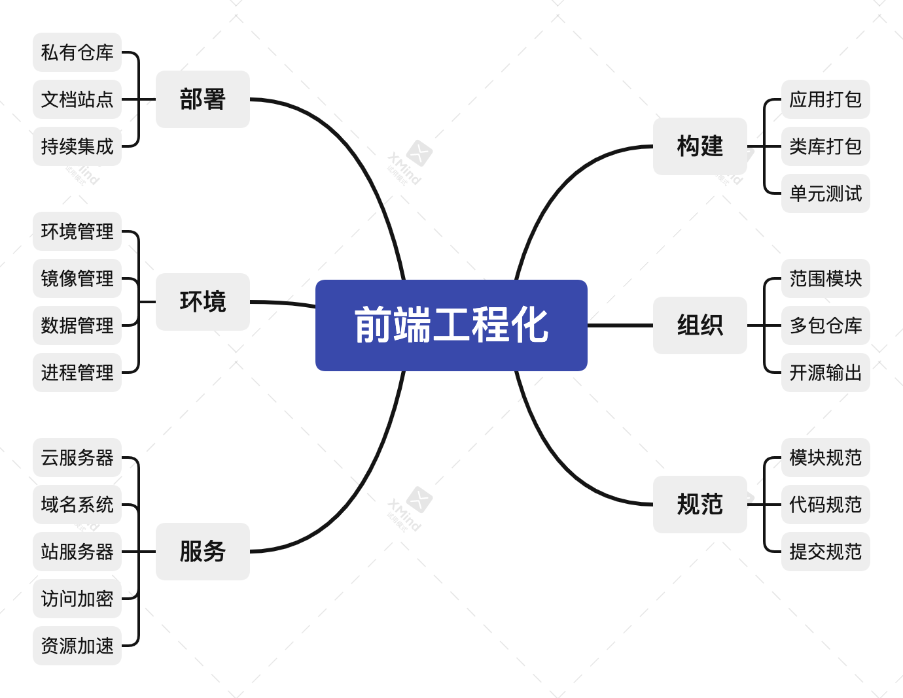

# 理解前端工程

1. 前端工程化到底是什么？

前端工程化指使用软件工程的技术与方法对前端开发的技术、工具、流程、经验、方案等指标标准化，它具备**模块化、组件化、规范化、自动化**四大特性，主要目的是**降低成本与增加效率**。

2. 将前端工程化的开发思维与解决方案应用到项目中，利用好它的优势，就能轻松实现这些非业务需求，为业务降本增效。

3. 前端工程化不是某个具体的工具，而是**对项目的整体架构与整体规划，使开发者能在未来可判时间内动态规划发展走向，以提升整个项目对用户的服务周期。**学习前端工程化不仅能理解清楚一个项目的完整流程，遇到困难也能在复杂的流程中快速定位并解决问题，还能根据自身知识储备制定一些可扩展流程，甚至可预见项目的未来发展方向。

4. 如何系统学习前端工程化？

- 首先要有明确前后端任务分离的能力。简而言之，能一眼看出该任务属于前端还是后端，划分好前后端的职责更利于前端工程化的接入。这也是基于前端工程化解决问题的基础。
- 前端工程化的四大核心特性，模块化、组件化、规范化和自动化

5. 概述图：



## 模块化

1. 模块化指将一个复杂应用根据预设规范封装为多个块并组合起来，对内实现数据私有化，对外暴露接口与其它模块通信。

模块化是前端工程化的重中之重。它在前端工程化中具体表现为：在文件层面上对代码与资源实现拆分与组装，将一个大文件拆分为互相依赖的小文件，再统一拼装与加载。

对于一个完善的 Web 项目，一般是 SPA/MPA，推荐使用以下目录结构将整个项目划分为各种通用模块。

```md
project
├─ dist # 输出目录
│ ├─ prod # 生产环境执行代码
│ └─ test # 测试环境执行代码
├─ src # 源码目录
│ ├─ apis # 接口模块：包括全局接口请求的功能，控制数据定向转换
│ ├─ assets # 资源模块：包括样式、脚本、字体、图像、音频、视频等资源文件
│ ├─ components # 组件模块：包括全局通用的基础组件、皮肤主题和字体图标
│ ├─ layouts # 布局模块：包括以布局为最小粒度的组件集合，由至少一个基础组件组成
│ ├─ flows # 流程模块：包括以流程为最小粒度的组件集合，由至少一个基础组件组成
│ ├─ pages # 页面模块：包括以页面为最小粒度的组件集合，由至少一个基础组件组成
│ ├─ routes # 路由模块：包括全局页面跳转的功能，控制页面自由切换
│ ├─ stores # 数据模块：包括全局数据状态的功能，控制数据驱动视图
│ ├─ views # 视图模块：包括以视图为最小粒度的组件集合，由至少一个基础组件组成
│ ├─ utils # 工具模块：包括全局通用的常量与方法
│ ├─ index.html # 模板入口文件
│ ├─ index.js # 脚本入口文件
│ └─ index.scss # 样式入口文件
└─ package.json
```

## 组件化

1.组件化指将一个具备通用功能的交互设计划分为模板、样式和逻辑组成的功能单元，对内管理内部状态满足交互需求，对外提供属性接口扩展用户需求。

2. 组件化是前端工程化的重要基础。它实现了代码更高层次的复用性，提升开发效率。组件的封装也是对象的封装，同样要做到高内聚低耦合，组件化的项目不仅利于单元测试的进行，同样也利于需求迭代的推进。

3. 组件化应遵循以下设计哲学：

- 将设计图划分为最小组件层级
- 使用预设规范创建组件静态版本
- 确定组件内部最小且完整的状态的表示方式
- 确定组件内部最小且完整的状态的存放方式
- 实现数据流的正向传递与反向传递

4. 模块化着重在文件层面上对代码与资源实现拆分与组装，组件化着重在功能层面上对交互与设计实现拆分与组装。

## 规范化

1. 规范化指将一系列预设规范接入工程各个阶段，通过各项指标标准化开发者的工作流程，引导开发者在团队协作中往更好的方向发展。

2. 规范化是前端工程化的重要部分。它有效地将一盘松散的规范通过指定标准凝聚在一起，将所有工作流程标准化，协同所有开发者以标准化的方式定义工作流程，同时也影响着代码、文档和日志，甚至影响着每个开发者及其团队发展方向，因此每个成熟的前端团队都有一套身经百战的规范化方案。

3. 规范化更多应用在团队协作中，为每个开发者指明一个方向，引领着成员往该方向走。若团队无规范化，每个开发者各做各的事情，在合并代码时肯定会发生争吵，甚至影响工作效率。

## 自动化

1. 自动化指将一系列繁琐重复的工作流程交由程序根据预设脚本自动处理，整个工作流程无需人工参与，以解放开发者双手让其更专注业务需求的开发。

2. 自动化是前端工程化的智能部分。它既可解放双手又能节省大量时间做更多有意义的事情，常见自动化场景包括但不限于自动化构建、自动化测试、自动化打包、自动化发布和自动化部署，更高级的自动化场景包括但不限于持续集成、持续交付和持续部署。

3. 自动化构建

|    任务    |     作用      |
| :--------: | :-----------: |
| Stylelint  | 校验样式代码  |
|   Eslint   | 校验脚本代码  |
|  Postcss   | Postcss → CSS |
|    Sass    |  SASS → CSS   |
|    Less    |  LESS → CSS   |
|   Babel    |   ES6 → ES5   |
| TypeScript |    TS → JS    |

自动化整体重心偏向于构建，构建为工程服务，工程又为用户服务，因此一个项目会演化出至少两种运行环境，分别是开发环境与生产环境。其中开发环境工程为开发者服务，生产环境工程为用户服务。

4. 如何思考前端工程化？

- 前后分离：前端应自成体系且与后端分离，包括但不限于规范、服务、环境、构建、组织和部署方面
- 技术选型：不能以一个框架满足所有业务场景，需制定多套框架解决方案避免技术瓶颈的出现
- 重构封装：新生技术不断涌现就要避免改头换面式的重构，重复需求不断出现就要学会举一反三的封装
- 工程设计：解决方案要合理分层且互相独立，随时应对各种变化，任何一层可低成本被替换与淘汰
